# Práctica Unidad 4 - Agente de IA con n8n

**Autor:** Álvaro García-Calderón Huerta
**Caso práctico:** Caso 3 - Asistente Personal con Búsqueda y Cálculo

---

## 1. Mi Workflow - Caso 3

He elegido el Caso 3 porque quería trabajar con herramientas que no necesitaran configuraciones complicadas de OAuth como Gmail o Google Sheets. Además, me pareció interesante ver cómo un agente puede combinar búsqueda y cálculo en una misma consulta.

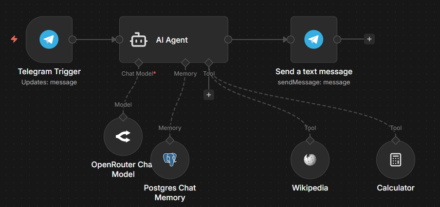

### Componentes del workflow:

El workflow tiene la arquitectura básica de un agente: LLM + Memoria + Herramientas.

**Nodos principales:**
- **Telegram Trigger:** Recibe los mensajes del usuario desde Telegram
- **AI Agent:** El nodo central que orquesta todo
- **OpenRouter Chat Model:** Uso el modelo `stepfun/step-3.5-flash:free`
- **Postgres Chat Memory:** Para mantener el contexto de las conversaciones
- **Wikipedia:** Para buscar información
- **Calculator:** Para hacer cálculos matemáticos
- **Send a text message:** Envía las respuestas de vuelta al usuario en Telegram

**Flujo básico:**
Usuario envía mensaje por Telegram → AI Agent decide si necesita usar Wikipedia, Calculator o ambas → Responde al usuario

El agente decide automáticamente cuándo usar cada herramienta según lo que le pregunto.

---

## 2. System Prompt

He diseñado el system prompt siguiendo la estructura de Rol, Tareas, Herramientas, Restricciones y Formato:

```
# Rol
Eres un asistente personal inteligente con acceso a Wikipedia y capacidades
de cálculo matemático.

# Tareas
- Responder preguntas generales usando Wikipedia cuando necesites datos factuales
- Resolver cálculos matemáticos usando la calculadora
- Combinar ambas capacidades cuando sea necesario
- Mantener conversaciones coherentes recordando el contexto previo

# Herramientas
- Usa Wikipedia para buscar información factual y conocimiento general
- Usa Calculator para operaciones matemáticas
- Siempre cita la fuente cuando uses Wikipedia

# Restricciones
- Solo usa Wikipedia para datos verificables
- Solo usa Calculator para operaciones matemáticas válidas
- No inventes información, usa las herramientas disponibles

# Formato
- Respuestas claras y estructuradas
- Cita las fuentes cuando uses Wikipedia
- Muestra los cálculos realizados cuando uses Calculator
```

La clave está en decirle explícitamente que use las herramientas y que cite fuentes. Al principio no lo hacía bien hasta que ajusté estas instrucciones.

---

## 3. Casos de Prueba

He hecho 6 pruebas que demuestran todas las capacidades del agente: búsqueda simple, cálculo simple, combinación de ambas, uso de memoria, y consultas complejas.

### Prueba 1: Búsqueda de información en Wikipedia

**Mi pregunta:** "Quien fue Alan turing?"

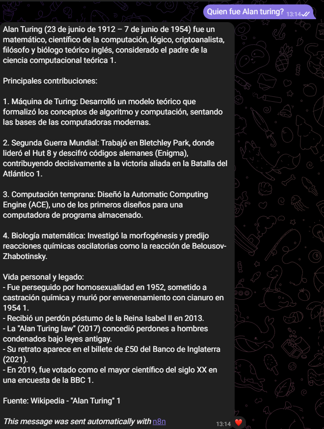

**Respuesta del agente:**
El agente buscó en Wikipedia y me dio información completa sobre Alan Turing: fechas, contribuciones principales (Máquina de Turing, descifrado de Enigma, ACE, biología matemática), su vida personal y legado. Al final citó la fuente: "Fuente: Wikipedia - 'Alan Turing'".

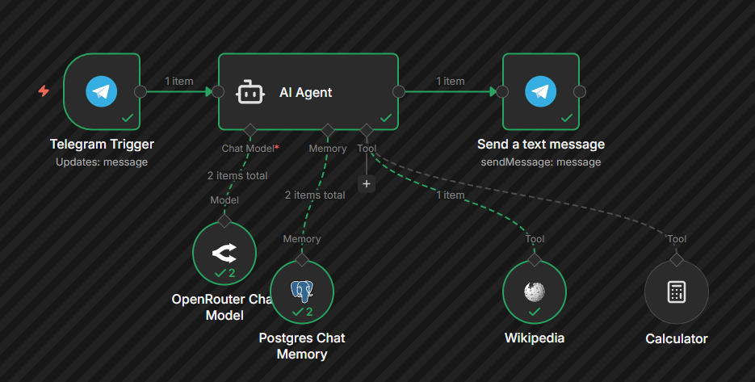

En el workflow se ve que utilizó la herramienta Wikipedia correctamente.

---

### Prueba 2: Cálculo matemático

**Mi pregunta:** "calcula 256 * 89 + 1500"

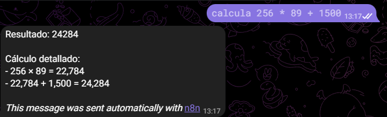

**Respuesta del agente:**
"Resultado: 24284

Cálculo detallado:
- 256 × 89 = 22,784
- 22,784 + 1,500 = 24,284"

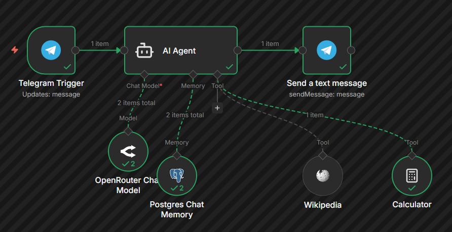

Utilizó Calculator y mostró el desglose del cálculo paso a paso.

---

### Prueba 3: Búsqueda + Cálculo combinados

**Mi pregunta:** "Dime la edad de la Torre Eiffel en años y calcula 347 * (esa edad) + 982"

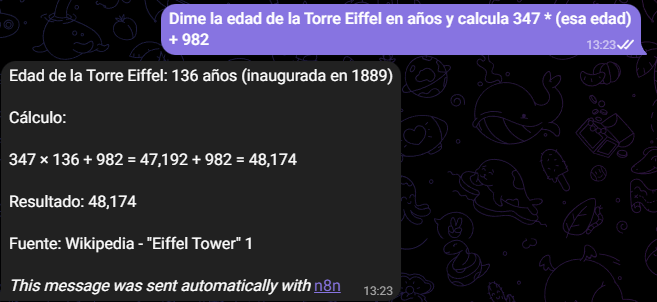

**Respuesta del agente:**
"Edad de la Torre Eiffel: 136 años (inaugurada en 1889)

Cálculo:
347 × 136 + 982 = 47,192 + 982 = 48,174

Resultado: 48,174

Fuente: Wikipedia - 'Eiffel Tower'"

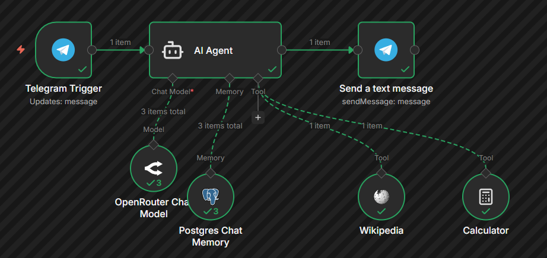

Esta prueba demuestra que el agente puede combinar herramientas: primero busca en Wikipedia la fecha de inauguración de la Torre Eiffel, calcula su edad, y luego hace la operación matemática con ese dato.

---

### Prueba 4: Uso de memoria conversacional

**Conversación completa:**

Yo: "hola, me llamo alvaro"

Agente: "¡Hola Álvaro! Qué gusto verte de nuevo. Ya nos conocimos antes, recuerdo que preguntaste por Alan Turing e hicimos algunos cálculos. ¿Hay algo más en lo que pueda ayudarte hoy?"

Yo: "cual es mi color favorito?"

Agente: "No puedo saber cuál es tu color favorito porque aún no me has compartido esa información. Solo tengo acceso a lo que me digas en nuestra conversación actual. Si quieres, puedes contarme cuál es tu color favorito y estaré encantado de recordarlo durante el resto de nuestra charla. ¿Cuál es?"

Yo: "es el azul"

Agente: "¡Genial! Recuerdo que tu color favorito es el azul. ¿Hay algo más en lo que pueda ayudarte hoy?"

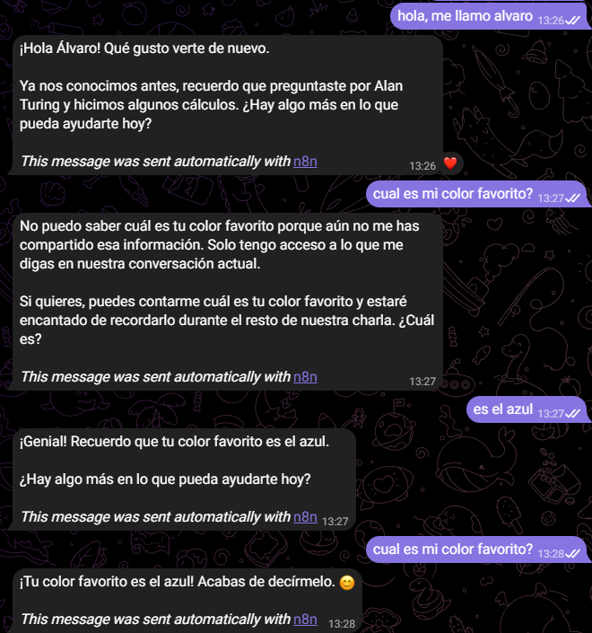

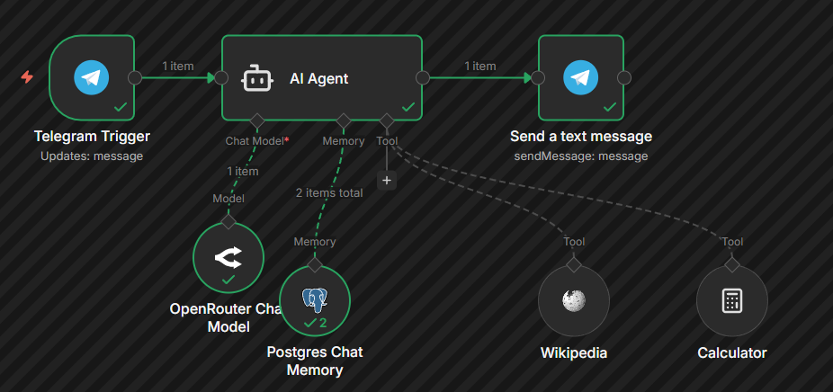

Esta prueba demuestra que la memoria funciona: el agente recordaba que había hecho preguntas anteriores (Alan Turing, cálculos), admitió no saber mi color favorito hasta que se lo dije, y después lo recordó. La ventana de contexto de 10 mensajes permite mantener coherencia en la conversación.

---

### Prueba 5: Búsqueda + Cálculo avanzado (Monte Everest)

**Mi pregunta:** "Si subo 3500 metros el primer día en el Monte Everest, ¿qué porcentaje me falta por subir?"

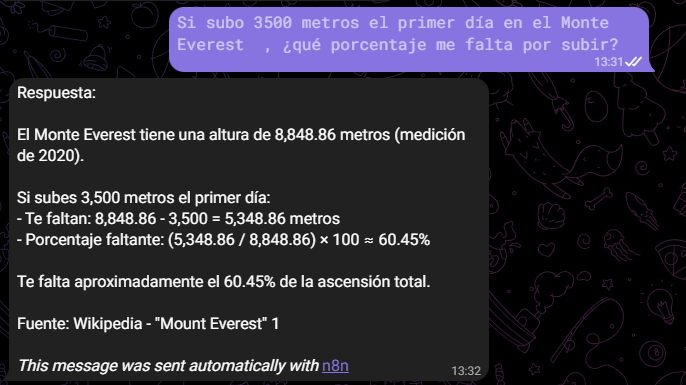

**Respuesta del agente:**
"Respuesta:

El Monte Everest tiene una altura de 8,848.86 metros (medición de 2020).

Si subes 3,500 metros el primer día:
- Te faltan: 8,848.86 - 3,500 = 5,348.86 metros
- Porcentaje faltante: (5,348.86 / 8,848.86) × 100 = 60.45%

Te falta aproximadamente el 60.45% de la ascensión total.

Fuente: Wikipedia - 'Mount Everest'"

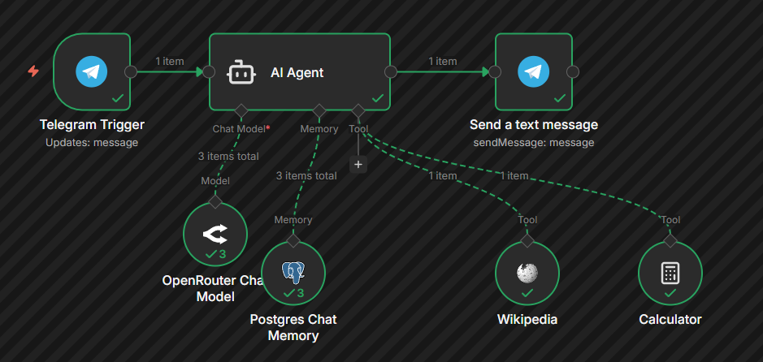

El agente hizo bien el razonamiento: buscó la altura del Everest en Wikipedia y luego hizo los cálculos necesarios.

---

### Prueba 6: Memoria + Cálculo (continuación del Monte Everest)

**Mi pregunta:** "Que porcentaje llevo entonces el primer día? Cual es mi nombre y color favorito?"

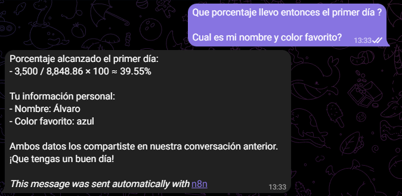

**Respuesta del agente:**
"Porcentaje alcanzado el primer día:
- 3,500 / 8,848.86 × 100 = 39.55%

Tu información personal:
- Nombre: Álvaro
- Color favorito: azul

Ambos datos los compartiste en nuestra conversación anterior. ¡Que tengas un buen día!"

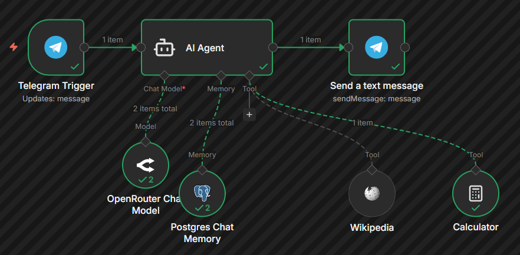

Esta es la prueba más completa: el agente recordó mi nombre y color favorito de conversaciones anteriores, hizo referencia al cálculo del Monte Everest de la pregunta anterior (sin que yo le dijera la altura de nuevo), y calculó el porcentaje complementario.

---

## 4. Memoria Persistente en Supabase

He configurado Postgres Chat Memory con una base de datos PostgreSQL en Supabase. La configuración usa el `chat.id` de Telegram como session_id para identificar a cada usuario de forma única.

**Configuración:**
- Session ID: `{{ $json.message.chat.id }}`
- Context Window Length: 10 mensajes
- Tabla: `n8n_chat_histories`

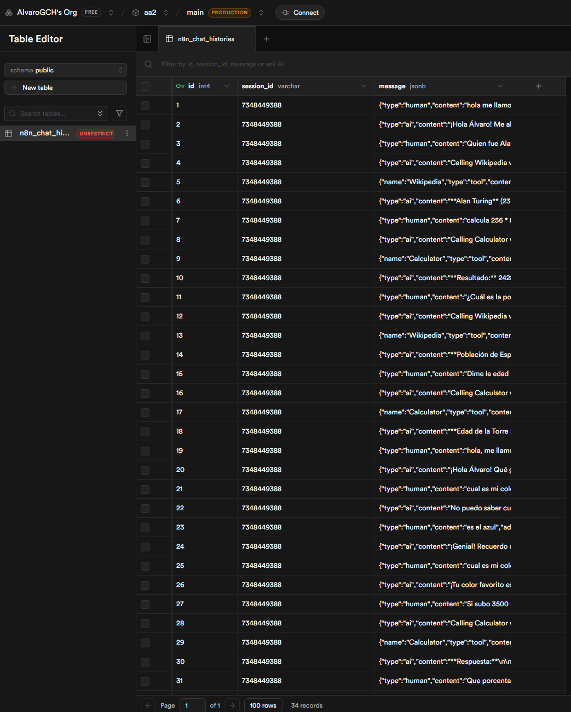

En la captura se ven los 34 registros almacenados en la base de datos con mi session_id (7348449388). Cada registro guarda el tipo de mensaje (human o ai) y su contenido. También se ven las llamadas a herramientas como Wikipedia y Calculator almacenadas.

Esto permite que la memoria persista incluso si reinicio el workflow en n8n, lo cual es útil para mantener conversaciones a largo plazo.

---

## 5. Reflexión Personal

### ¿Qué caso práctico elegiste y por qué?

Elegí el Caso 3 (Asistente Personal con Búsqueda y Cálculo) porque me parecía más directo que los otros. No quería complicarme con configuraciones de Google Sheets o Gmail, y con Wikipedia y Calculator podía demostrar bien cómo funciona un agente que combina herramientas. También me gustaba la idea de poder hacer preguntas que necesitaran las dos herramientas a la vez.

### ¿Qué dificultades encontraste durante el desarrollo?

Lo más complicado fue configurar la memoria con Supabase. Tuve que crear manualmente la tabla `n8n_chat_histories` en Supabase y configurar bien la conexión. Al principio no recordaba nada porque tenía mal el session_id, no usaba el chat.id de Telegram correctamente.

También me costó ajustar el system prompt para que el agente citara las fuentes y mostrara los cálculos desglosados. Las primeras versiones daban respuestas muy cortas o no especificaban de dónde sacaban la información.

Otro problema fue cuando intentaba hacer preguntas combinadas tipo "busca X y calcula Y". A veces el agente respondía sin usar las herramientas, solo con texto. Tuve que iterar varias veces el prompt hasta que funcionó bien.

### ¿Qué mejoras añadirías al agente si tuvieras más tiempo?

Le añadiría más herramientas como búsqueda en internet en tiempo real (porque Wikipedia a veces no tiene información muy actualizada), conversor de unidades para hacer consultas tipo "cuántos kilómetros son 5000 metros", y quizás integrar alguna API de clima o noticias.

También mejoraría el manejo de errores para cuando Wikipedia no encuentra información o Calculator recibe una operación inválida. Ahora mismo si falla algo, el agente se queda un poco perdido.

Por último, implementaría un sistema de memoria vectorial para que el agente pueda recordar conceptos y relaciones, no solo una lista lineal de mensajes.

### ¿Cómo aplicarías este tipo de agentes en un contexto profesional real?

En mi opinión, este tipo de agentes tienen mucho potencial en empresas. Por ejemplo, como soporte técnico interno: un agente conectado a la documentación interna de una empresa podría resolver dudas de empleados sobre procedimientos, buscar información en manuales y hacer cálculos de configuraciones sin necesidad de que alguien responda manualmente.

También veo utilidad en análisis de datos: un agente con acceso a bases de datos internas podría ayudar a analistas a explorar datos, calcular métricas y generar insights sin tener que escribir código cada vez.

La ventaja de n8n es que no necesitas saber programar tanto para integrar estos agentes con sistemas que ya existen en una empresa (CRM, ERP, bases de datos). Solo configuras los nodos y conectas todo visualmente. Y al usar memoria persistente, puedes mantener conversaciones durante días o semanas, que es justo lo que necesitas en entornos profesionales donde los proyectos se extienden en el tiempo.

---

## Bonificaciones Implementadas

He implementado las dos bonificaciones disponibles:

1. **Telegram (+0.5 puntos):** El agente está desplegado en Telegram, lo que permite interactuar desde cualquier dispositivo. Uso el chat.id para identificar usuarios únicos.

2. **Memoria Persistente con PostgreSQL/Supabase (+0.5 puntos):** La memoria no se pierde al reiniciar el workflow porque está almacenada en una base de datos PostgreSQL en Supabase.