# Práctica Unidad 5 - Sistema RAG con n8n

**Autor:** Álvaro García-Calderón Huerta
**Opción elegida:** Opción A - n8n (No-Code)

---

## 1. Arquitectura del Sistema

El sistema RAG implementado sigue la arquitectura clásica de Retrieval-Augmented Generation con dos workflows independientes en n8n:

### Workflow de Ingesta (se ejecuta una vez)

```
[Manual Trigger] → [Code (JavaScript)] → [Pinecone Vector Store (Insert)]
                                                ↑
                                    [Embeddings OpenAI] + [Default Data Loader]
                                                               ↑
                                                   [Recursive Character Text Splitter]
```

**Flujo detallado:**
1. El nodo Code contiene los 2 documentos de TechCorp (políticas RRHH y procedimiento soporte) como texto plano
2. El Default Data Loader recibe los documentos y los pasa al Text Splitter
3. El Recursive Character Text Splitter divide cada documento en chunks de 300 caracteres con 30 de solapamiento
4. Embeddings OpenAI genera vectores de 1536 dimensiones para cada chunk usando `text-embedding-ada-002`
5. Pinecone Vector Store almacena los 34 vectores resultantes en el índice `empresa-docs`

### Workflow del Agente RAG (siempre activo)

```
[Telegram Trigger] → [AI Agent] → [Send a text message (Telegram)]
                         ↑
            [OpenAI Chat Model (gpt-4o-mini)]
            [Postgres Chat Memory (Supabase)]
            [Pinecone Vector Store (Tool)] ← [Embeddings OpenAI]
```

**Flujo detallado:**
1. El usuario envía un mensaje por Telegram
2. El AI Agent recibe el mensaje y decide usar la herramienta `buscar_documentacion`
3. La herramienta convierte la pregunta en un vector (embedding) y busca los 4 chunks más similares en Pinecone
4. El agente recibe los chunks recuperados como contexto y genera una respuesta usando GPT-4o-mini
5. La respuesta se envía de vuelta al usuario por Telegram

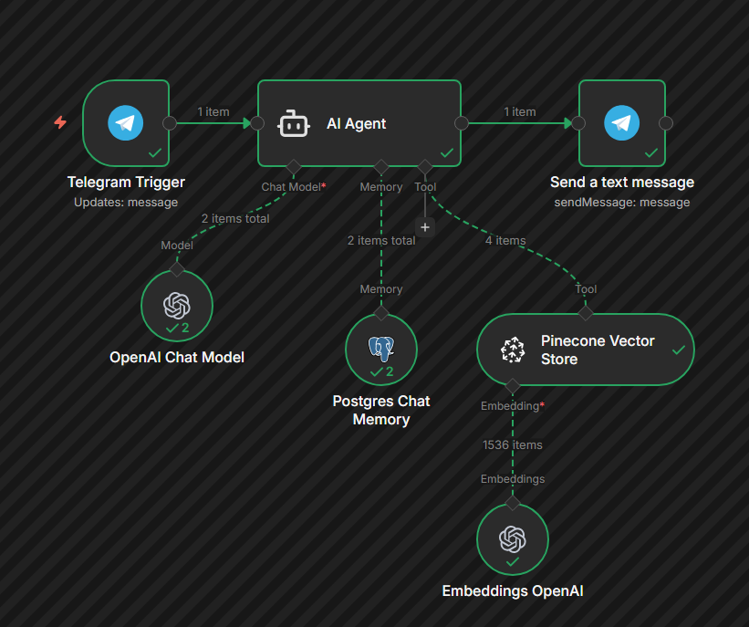

---

## 2. Decisiones Técnicas

### ¿Por qué n8n?
Elegí n8n porque ya lo había utilizado en la práctica de la Unidad 4 (Agente Q&A con Wikipedia y Calculator). Esto me permitió reutilizar gran parte de la infraestructura: el bot de Telegram, la memoria persistente en Supabase y la estructura general del workflow. Solo tuve que reemplazar las herramientas (Wikipedia y Calculator) por el Vector Store Tool conectado a Pinecone.

### Tamaño de chunk: 300 caracteres, overlap 30
Usé los parámetros recomendados en el enunciado. Con chunk size de 300, los documentos se dividieron en 34 chunks en total, lo que proporciona una granularidad adecuada para recuperar información específica sin perder demasiado contexto. El overlap de 30 caracteres evita que se corte información en los límites entre chunks.

### Número de documentos recuperados (k): 4
Configuré el Pinecone Vector Store Tool con un límite de 4 documentos por consulta. Esto proporciona suficiente contexto al modelo sin sobrecargar el prompt.

### Modelo de lenguaje: GPT-4o-mini (OpenAI)
Inicialmente intenté usar modelos gratuitos a través de OpenRouter (`google/gemma-3-27b-it:free` y `meta-llama/llama-3.3-70b-instruct:free`), pero ninguno soportaba tool use (function calling), que es necesario para que el agente pueda llamar a la herramienta de búsqueda vectorial. Cambié a GPT-4o-mini de OpenAI directamente, que soporta tool use al 100% y tiene un coste muy reducido.

### Embeddings: text-embedding-ada-002
Es el modelo estándar de OpenAI para embeddings con 1536 dimensiones. Es el que recomienda la práctica y tiene buena relación calidad/precio.

### Memoria: Postgres Chat Memory (Supabase)
Reutilicé la configuración de la Unidad 4 con PostgreSQL en Supabase. Usa el `chat.id` de Telegram como session_id para identificar a cada usuario. La ventana de contexto está configurada a 10 mensajes.

### Base vectorial: Pinecone
Elegí Pinecone por ser la opción recomendada en el enunciado. El plan gratuito es suficiente para esta práctica. El índice `empresa-docs` está configurado con 1536 dimensiones y métrica coseno.

### System Prompt
El prompt del agente sigue la estructura Rol-Tareas-Restricciones-Formato. La restricción más importante es que el agente SOLO puede responder con información que esté en la documentación, y debe responder con un mensaje predefinido cuando no encuentra información relevante.

---

## 3. Ejemplos de Funcionamiento

### Prueba 1: Recuperación de dato específico
**Pregunta:** "¿Cuántos días de vacaciones tengo al año?"

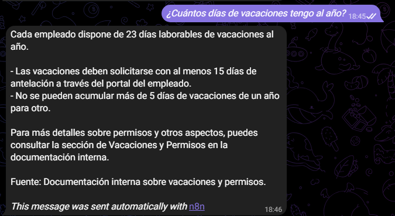

**Respuesta del agente:**
El agente respondió correctamente: 23 días laborables de vacaciones al año. También incluyó información adicional relevante: solicitud con 15 días de antelación y máximo 5 días acumulables de un año para otro.

**Chunks recuperados (4):**

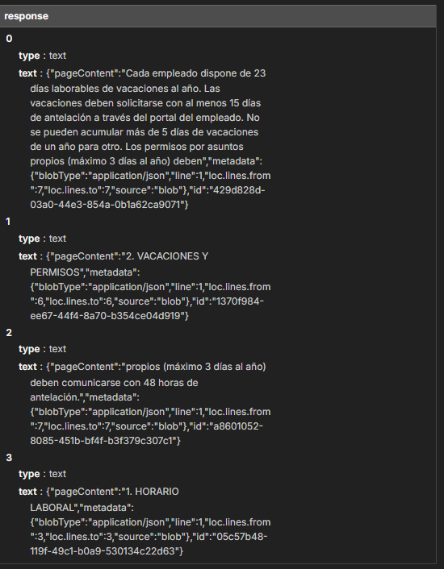

| Chunk | Contenido | Fuente |
|-------|-----------|--------|
| 0 | "Cada empleado dispone de 23 días laborables de vacaciones al año. Las vacaciones deben solicitarse con al menos 15 días de antelación..." | politicas_rrhh.txt |
| 1 | "2. VACACIONES Y PERMISOS" | politicas_rrhh.txt |
| 2 | "propios (máximo 3 días al año) deben comunicarse con 48 horas de antelación." | politicas_rrhh.txt |
| 3 | "1. HORARIO LABORAL" | politicas_rrhh.txt |

**Evaluación:** Respuesta correcta, completa y con fuente citada. Los 4 chunks provienen del documento de políticas de RRHH, centrados en la sección de vacaciones y permisos.


---

### Prueba 2: Respuesta con pasos secuenciales
**Pregunta:** "¿Cuál es el procedimiento para reportar una incidencia técnica?"

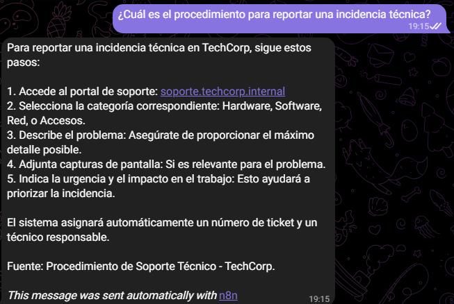

**Respuesta del agente:**
El agente proporcionó los pasos secuenciales correctamente:
1. Acceder al portal de soporte (soporte.techcorp.internal)
2. Seleccionar la categoría correspondiente (Hardware, Software, Red, Accesos)
3. Describir el problema con el máximo detalle posible
4. Adjuntar capturas de pantalla si es relevante
5. Indicar la urgencia y el impacto en el trabajo

Citó la fuente: Procedimiento de Soporte Técnico - TechCorp.

**Chunks recuperados (4):**

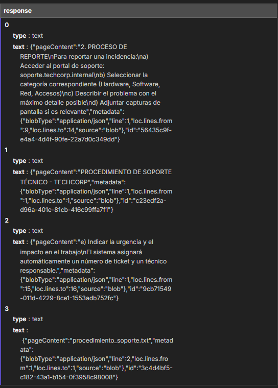

| Chunk | Contenido | Fuente |
|-------|-----------|--------|
| 0 | "2. PROCESO DE REPORTE - Para reportar una incidencia: a) Acceder al portal de soporte..." | procedimiento_soporte.txt |
| 1 | "e) Indicar la urgencia y el impacto en el trabajo. El sistema asignará automáticamente un número de ticket..." | procedimiento_soporte.txt |
| 2 | "PROCEDIMIENTO DE SOPORTE TÉCNICO - TECHCORP - 1. CLASIFICACIÓN DE INCIDENCIAS..." | procedimiento_soporte.txt |
| 3 | "d) Adjuntar capturas de pantalla si es relevante..." | procedimiento_soporte.txt |

**Evaluación:** Respuesta correcta, bien estructurada con pasos numerados y fuente citada. Los 4 chunks provienen del documento de soporte técnico, cubriendo el proceso de reporte completo.

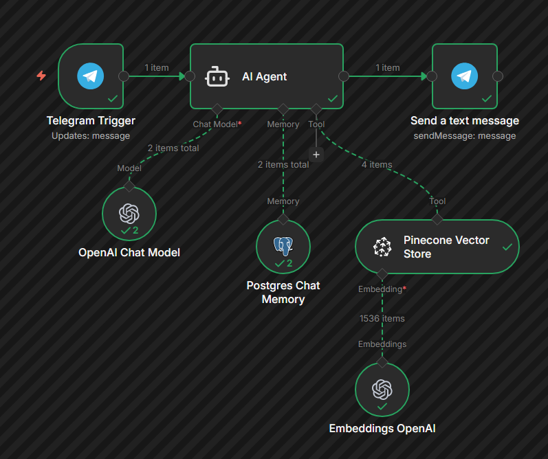

---

### Prueba 3: Interpretación y matiz
**Pregunta:** "¿Puedo trabajar desde casa todos los días de la semana?"

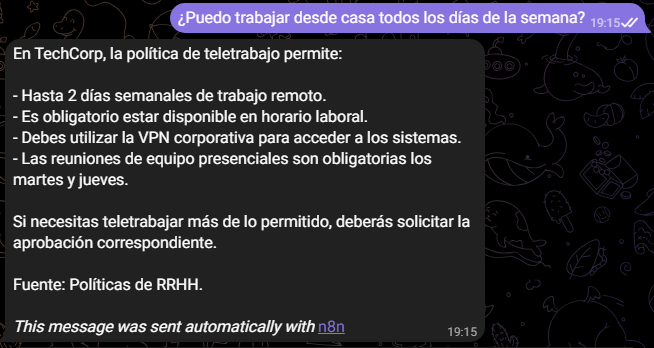

**Respuesta del agente:**
El agente respondió correctamente que NO se puede teletrabajar todos los días. La política permite hasta 2 días semanales de trabajo remoto. Incluyó los detalles relevantes: uso obligatorio de VPN corporativa, disponibilidad en horario laboral, reuniones presenciales obligatorias los martes y jueves, y necesidad de aprobación del director de área para teletrabajo adicional.

**Chunks recuperados (4):**

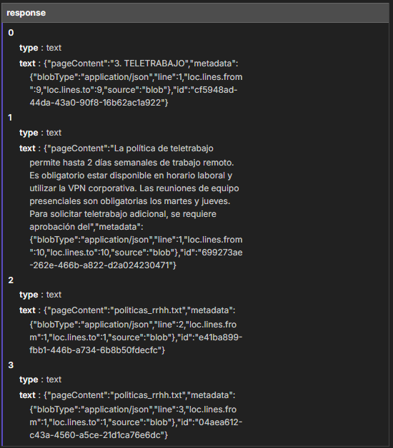

| Chunk | Contenido | Fuente |
|-------|-----------|--------|
| 0 | "3. TELETRABAJO" | politicas_rrhh.txt |
| 1 | "La política de teletrabajo permite hasta 2 días semanales de trabajo remoto. Es obligatorio estar disponible en horario laboral..." | politicas_rrhh.txt |
| 2 | "obligatorias los martes y jueves. Para solicitar teletrabajo adicional, se requiere aprobación del director de área." | politicas_rrhh.txt |
| 3 | "1. HORARIO LABORAL - El horario estándar es de 9:00 a 18:00..." | politicas_rrhh.txt |

**Evaluación:** Respuesta correcta con el matiz clave: NO se puede teletrabajar todos los días, solo máximo 2. El agente interpretó bien la pregunta y contrastó con la política real. Los chunks cubren toda la sección de teletrabajo.

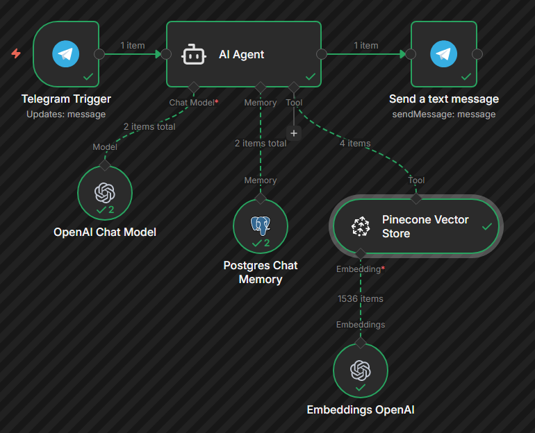

---

### Prueba 4: Caso negativo (información no disponible)
**Pregunta:** "¿Cuál es el menú del comedor de la empresa?"


**Respuesta del agente:**
"No dispongo de información sobre ese tema en la documentación de la empresa. Te recomiendo contactar con el departamento correspondiente."

**Chunks recuperados:**

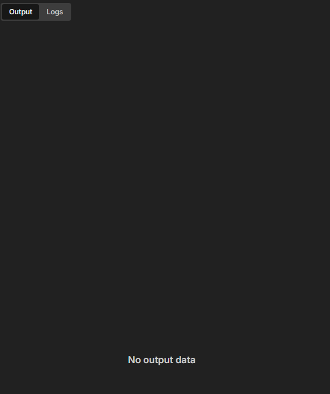

No se recuperaron chunks (No output data). El agente determinó que no había información relevante en la base vectorial sobre el menú del comedor y respondió con el mensaje predefinido en las restricciones del System Prompt.

**Evaluación:** El agente manejó correctamente el caso negativo. No inventó información sobre un menú de comedor que no existe en la documentación. Este comportamiento es fundamental en un sistema RAG: es preferible admitir que no se tiene la información a inventar una respuesta.

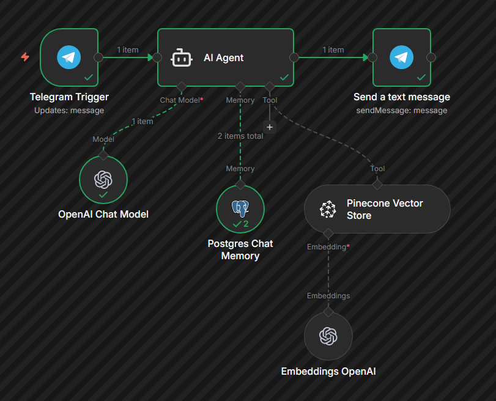

---

### Prueba 5: Dato específico de otro documento
**Pregunta:** "¿Cada cuánto tiempo debo cambiar mi contraseña?"

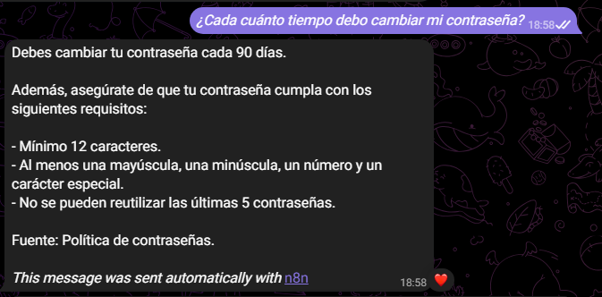

**Respuesta del agente:**
El agente respondió correctamente: cambio obligatorio cada 90 días. También incluyó los requisitos completos de la contraseña (mínimo 12 caracteres, mayúscula, minúscula, número y carácter especial) y la información sobre bloqueo tras 5 intentos fallidos.

**Chunks recuperados (4):**

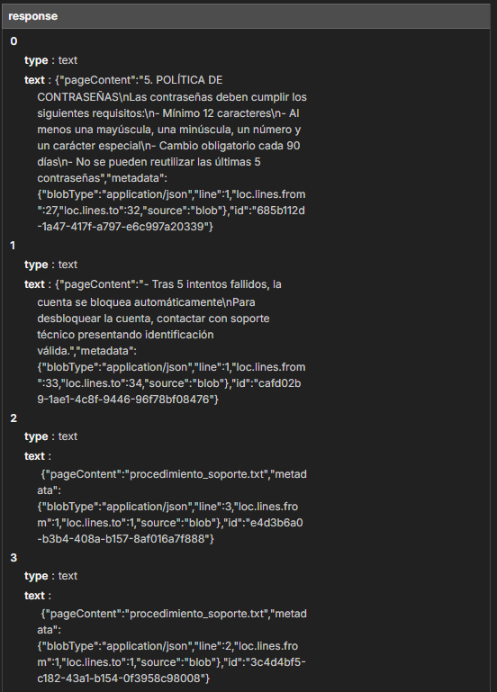

| Chunk | Contenido | Fuente |
|-------|-----------|--------|
| 0 | "5. POLÍTICA DE CONTRASEÑAS - Las contraseñas deben cumplir los siguientes requisitos: - Mínimo 12 caracteres..." | procedimiento_soporte.txt |
| 1 | "- Cambio obligatorio cada 90 días - No se pueden reutilizar las últimas 5 contraseñas..." | procedimiento_soporte.txt |
| 2 | "5. EVALUACIÓN DEL DESEMPEÑO - Las evaluaciones se realizan semestralmente..." | politicas_rrhh.txt |
| 3 | "se requiere aprobación del director de área. 4. FORMACIÓN..." | politicas_rrhh.txt |

**Evaluación:** Respuesta correcta, recuperando información del documento de procedimiento de soporte técnico (diferente al de RRHH usado en las pruebas 1-3). Los chunks 0 y 1 contienen la información relevante sobre contraseñas. Los chunks 2 y 3 son de menor relevancia (del documento de RRHH), lo cual es normal en búsqueda vectorial. Demuestra que el sistema busca en toda la base de documentos.

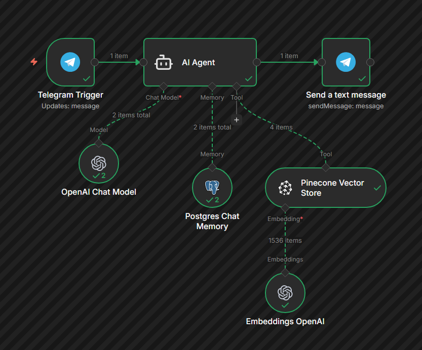

---

## 4. Mejoras Propuestas

### 1. Carga dinámica de documentos
Actualmente los documentos están embebidos directamente en el nodo Code del workflow de ingesta. Una mejora sería usar el nodo "Read/Write Files from Disk" para cargar automáticamente todos los archivos `.txt` de una carpeta. Esto permitiría añadir nuevos documentos sin modificar el workflow.

### 2. Re-ranking de resultados
Implementar un paso de re-ranking después de la búsqueda vectorial para mejorar la relevancia de los chunks recuperados. Pinecone ofrece esta funcionalidad en su nodo de n8n (la opción "Rerank Results" que estaba disponible pero desactivada en mi configuración). Esto ayudaría en consultas ambiguas donde los primeros resultados por similitud vectorial no son necesariamente los más relevantes.

### 3. Más documentos y categorías
Ampliar la base documental con más tipos de documentos: FAQs, guías de onboarding, políticas de seguridad, organigramas, etc. Esto haría al asistente más útil en un entorno empresarial real y permitiría probar la escalabilidad del sistema RAG.

### 4. Interfaz web complementaria
Además de Telegram, crear una interfaz web con el nodo "Chat Trigger" de n8n para que los empleados puedan acceder al asistente desde el navegador de la intranet. Esto no requiere que tengan Telegram instalado.

### 5. Feedback y mejora continua
Implementar un sistema donde los usuarios puedan valorar las respuestas (útil/no útil). Esto permitiría identificar preguntas frecuentes que no se responden bien y ajustar los parámetros del chunking o el prompt del agente.

---

## Bonificación: Canal externo (Telegram)

El sistema está desplegado en Telegram, permitiendo a los usuarios interactuar con el asistente desde cualquier dispositivo. Se reutilizó el bot de Telegram de la práctica de la Unidad 4, cambiando únicamente las herramientas y el System Prompt del agente.

La integración con Telegram aporta:
- Accesibilidad desde móvil y escritorio
- Identificación única de usuarios mediante chat.id
- Memoria persistente por usuario gracias a PostgreSQL/Supabase