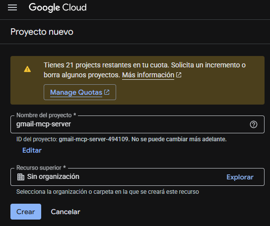
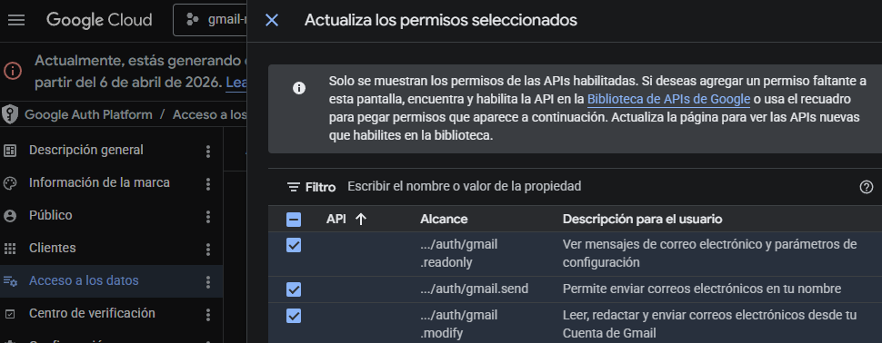
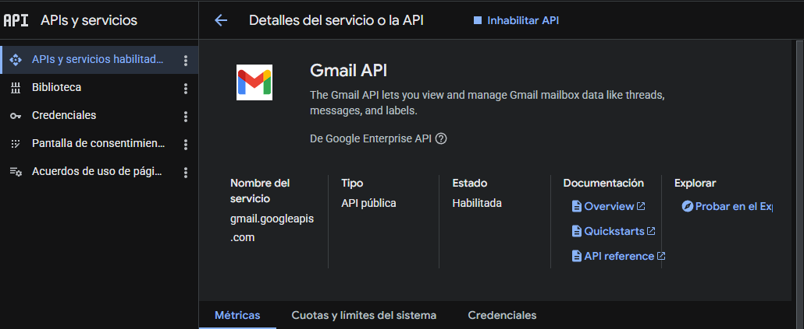
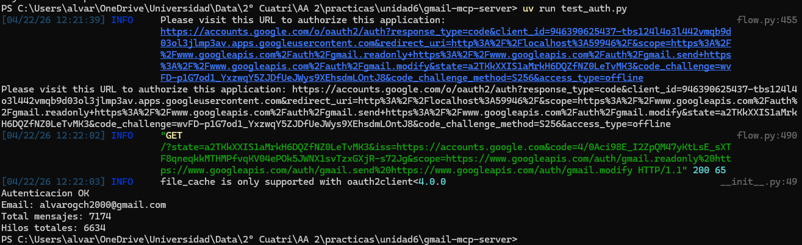
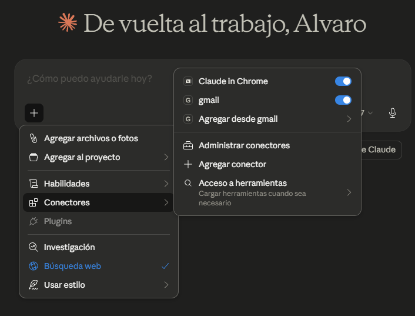
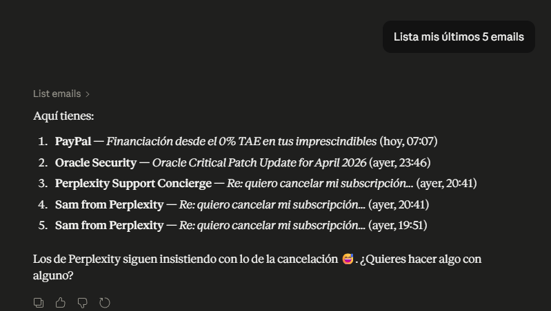
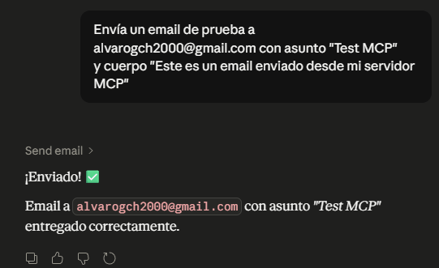
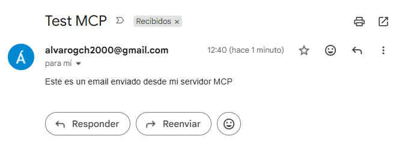
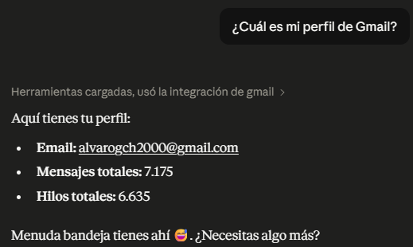
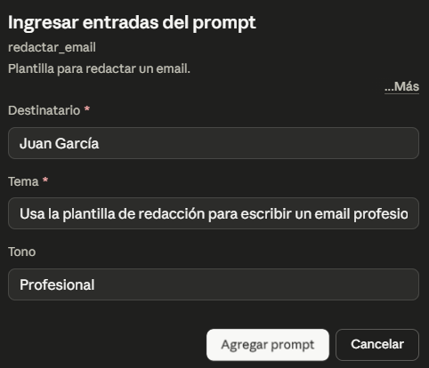

# Memoria - Práctica Unidad 6
## Gestor de Gmail con MCP

**Autor:** Álvaro García-Calderón
---

## 1. Descripción del flujo OAuth implementado

Para que el servidor MCP pueda acceder a la cuenta de Gmail del usuario sin exponer credenciales directamente, se ha implementado un flujo **OAuth 2.0** con Google Cloud. El proceso se divide en dos fases:

### 1.1 Configuración previa en Google Cloud Console

1. Se creó un proyecto llamado `gmail-mcp-server` en Google Cloud Console.
2. Se configuró la pantalla de consentimiento OAuth en modo **Externo**, añadiendo la cuenta `alvarogch2000@gmail.com` como usuario de prueba.
3. Se habilitaron los tres scopes necesarios:
   - `gmail.readonly` — para leer emails
   - `gmail.send` — para enviar emails
   - `gmail.modify` — para modificar emails
4. Se habilitó la **Gmail API** desde la biblioteca de APIs.
5. Se generaron unas credenciales OAuth de tipo **Aplicación de escritorio** y se descargó el archivo `credentials.json`.

### 1.2 Flujo OAuth en tiempo de ejecución

La función `get_gmail_service()` del servidor implementa el siguiente flujo:

1. **Comprueba si existe un `token.json`** con credenciales previamente autorizadas.
2. Si el token existe pero ha **expirado**, se renueva automáticamente mediante `creds.refresh(Request())` usando el `refresh_token`.
3. Si **no hay token** o no se puede renovar, se lanza `InstalledAppFlow.from_client_secrets_file()` que abre el navegador del usuario, solicita su consentimiento y obtiene un nuevo token.
4. El token se **persiste en `token.json`** para que las siguientes ejecuciones no pidan autorización de nuevo.

De esta forma, la primera vez que se ejecuta el servidor se abre el navegador (como se muestra en la verificación inicial con `test_auth.py`), pero en ejecuciones posteriores la autenticación es transparente.

---

## 2. Componentes del servidor MCP

El servidor se ha implementado utilizando la librería **FastMCP**, que simplifica la creación de servidores MCP mediante decoradores. Expone las tres primitivas MCP estudiadas en la unidad:

### 2.1 Tools (Herramientas)

Son acciones que el LLM puede ejecutar de forma autónoma.

| Tool | Descripción |
|------|-------------|
| `list_emails(max_results)` | Lista los emails más recientes de la bandeja de entrada, devolviendo remitente, asunto, fecha e ID. |
| `send_email(to, subject, body)` | Envía un email en texto plano codificando el mensaje en base64 URL-safe y llamando a `users().messages().send()`. |
| `get_profile_tool()` | Expone el perfil del usuario (se añadió también como tool para garantizar que Claude Desktop la invoque automáticamente). |

### 2.2 Resource (Recurso)

| Resource | URI | Descripción |
|----------|-----|-------------|
| `get_profile` | `gmail://profile` | Recurso de solo lectura que devuelve el email, total de mensajes y total de hilos del usuario autenticado. |

### 2.3 Prompt

| Prompt | Argumentos | Descripción |
|--------|------------|-------------|
| `redactar_email` | `destinatario`, `tema`, `tono` | Plantilla reutilizable que guía al LLM para redactar emails con un tono específico. |

### 2.4 Integración con Claude Desktop

Se configuró el archivo `%APPDATA%\Claude\claude_desktop_config.json` añadiendo el servidor `gmail` mediante `uv` como gestor de dependencias. Tras reiniciar Claude Desktop, el servidor aparece correctamente en el menú de **Conectores** con todas sus primitivas disponibles.

### 2.5 Pruebas realizadas

Se ejecutaron las cuatro pruebas funcionales descritas en el enunciado desde Claude Desktop:

**Prueba 1 — Listar emails:**

**Prueba 2 — Enviar email:**

**Prueba 3 — Consultar perfil:**

**Prueba 4 — Prompt de redacción:**

Todas las pruebas finalizaron con éxito, verificando que las tres primitivas MCP (tools, resource y prompt) son accesibles desde el cliente y producen el resultado esperado.

---

## 3. Dificultades encontradas

Durante el desarrollo surgieron varias dificultades, resueltas con la siguiente aproximación:

1. **Salida "confusa" al ejecutar el servidor manualmente.** Al lanzar `uv run gmail_mcp_server.py` en una terminal, aparecen errores tipo `Invalid JSON: EOF while parsing`. Esto es normal: el servidor habla JSON-RPC por stdio y no debe ejecutarse "a pelo". Se creó un script `test_auth.py` auxiliar para validar la autenticación sin depender del cliente MCP.

2. **Resources no se invocan automáticamente en Claude Desktop.** A diferencia de las tools, los resources MCP solo se utilizan cuando el usuario los adjunta manualmente al contexto (desde el menú "Agregar desde gmail"). Para que Claude invocara el perfil de forma natural ante una pregunta como *"¿Cuál es mi perfil de Gmail?"*, se añadió una tool adicional `get_profile_tool` que reutiliza la misma función interna `_build_profile_string()`, manteniendo así también el resource `gmail://profile` según pide la rúbrica.

3. **Prompts se inyectan como adjuntos de texto.** Claude Desktop convierte los prompts MCP en chips de texto que se añaden al contexto. La respuesta puede renderizarse con el componente visual interno de redacción de mensajes, lo que despista al leerla. Se verificó que el prompt se invoca correctamente inspeccionando el diálogo "Ingresar entradas del prompt" (donde aparecen los argumentos `destinatario`, `tema`, `tono`).

4. **Aviso de "app no verificada" en el flujo OAuth.** Al ser una aplicación en modo prueba, Google muestra una advertencia. Se solventó añadiendo la cuenta de correo como usuario de prueba en la pantalla de consentimiento y accediendo mediante "Configuración avanzada → Ir a Gmail MCP Server (no seguro)".
---

## 4. Posibles mejoras y extensiones

El servidor cumple los requisitos de la práctica, pero podría ampliarse en varias direcciones:

- **Búsqueda avanzada:** añadir una tool `search_emails(query)` que use el parámetro `q` de la Gmail API para permitir búsquedas tipo `from:`, `subject:`, `is:unread`, etc.
- **Gestión de etiquetas:** nuevas tools para marcar como leído, archivar, mover a papelera o añadir etiquetas (`gmail.modify` ya está en los scopes).
- **Adjuntos:** extender `send_email` para aceptar archivos adjuntos usando `MIMEMultipart`.
- **Lectura del cuerpo del mensaje:** actualmente `list_emails` solo devuelve metadatos; podría añadirse otra tool `read_email(id)` que decodifique el cuerpo en base64 y lo devuelva legible.
- **Más recursos:** exponer como resources listados específicos (`gmail://labels`, `gmail://drafts`) para enriquecer el contexto disponible al LLM.
- **Despliegue remoto con autenticación JWT** (bonificación sugerida en la práctica): empaquetar el servidor con un transporte HTTP/SSE y firmar los tokens del cliente para permitir conexiones seguras desde Claude Desktop sin tener el código en local.
- **Caching y rate limiting:** almacenar temporalmente resultados de `list_emails` y aplicar limitación de llamadas para no agotar la cuota de la Gmail API.
- **Tests automáticos:** añadir `pytest` con mocks del servicio de Gmail para verificar regresiones sin depender de credenciales reales.

---

## 5. Conclusión

La práctica permite experimentar de primera mano la potencia del protocolo MCP como capa de integración entre LLMs y servicios externos reales. Gracias a FastMCP, en menos de 130 líneas de código se expone una API completa (dos tools, un resource y un prompt) autenticada mediante OAuth 2.0 y accesible desde Claude Desktop como si fuera una extensión nativa. El mayor aprendizaje ha sido entender las diferencias prácticas entre **tools** (invocadas automáticamente), **resources** (adjuntados por el usuario) y **prompts** (plantillas reutilizables), así como la importancia de una buena gestión de credenciales en escenarios reales.
